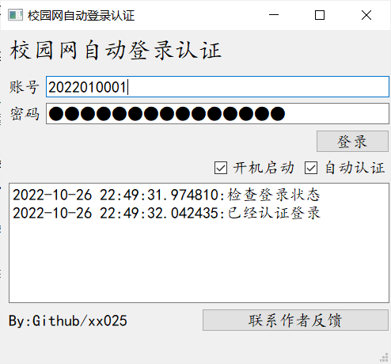

# autolink

**某校电信校园网自动登录认证**


- 🍔勾选自动认证，打开程序自动进行登录认证；不勾选需要手动点击登录
- 🧇可设置开机自启动，开机后自动启动程序；
- 🥞同时勾选自动认证和开机启动，开启电脑自动完成登录认证工作
- 🥩首次启动需要输入账号和密码，
- 🥡可将配置文件导出到移动设备，在另一台电脑上复制程序和配置文件也能一键登录


**打包**
```shell
pyinstaller -F main.py -w
```



